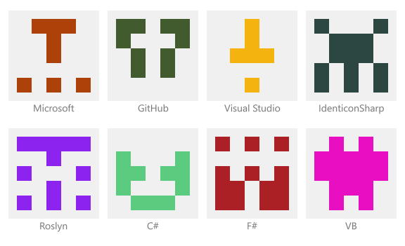

# IdenticonSharp [![Core NuGet][core-badge]][core-nuget] [![AspNetCore NuGet][asp-badge]][asp-nuget]

Cross-platform extendable library that allows you to create a variety of identicons without any efforts

-------------

## Goal

`IdenticonSharp` aims to collect as many identicon generation algorithms as possible, so anyone could customize the default appearance of avatars in a way that he and his users will like. Down with the boring static default avatars!

So if you have an idea to implement a new (or existing one) identicon - you're welcome to **fork** the project!

------

## Currently available identicons


### [GitHub Identicon](https://github.blog/2013-08-14-identicons/)



------

## Usage

Since you're likely to use a single type of identicon within the project, `IdenticonSharp` provides the [`IdenticonManager`](https://github.com/Kir-Antipov/IdenticonSharp/blob/master/KE.IdenticonSharp/IdenticonManager.cs) class, whose `Default` property represents the default identicon generator.

All identicon generators implement the [`IIdenticonProvider`](https://github.com/Kir-Antipov/IdenticonSharp/blob/master/KE.IdenticonSharp/Identicons/IIdenticonProvider.cs) interface, so you can generate an image (or an `svg`-document, if the generator supports it) from `string` or `byte[]`:

```csharp
string value = ...;
// or
byte[] value = ...;

if (IdenticonManager.Default.ProvidesSvg)
{
    var svg = IdenticonManager.Default.CreateSvg(value);
    svg.Save("identicon.svg");
}
else
{
    var img = IdenticonManager.Default.Create(value);
    img.Save("identicon.png");
}
```

If you need to replace *and/or* configure the default identicon generator, you can use the `ConfigureDefault` method as shown below:

```csharp
// Passing the type of generator and its options
IdenticonManager.ConfigureDefault<GitHubIdenticonProvider, GitHubIdenticonOptions>(options => {
    // Configuring the parameters
    options.Background = new Rgba32(240, 240, 240);
    options.SpriteSize = new Size(10, 10);
    options.Size = new Size(256, 256);
    options.HashAlgorithm = HashProvider.SHA512;
});
```

The same can be done less verbose:

```csharp
IdenticonManager.ConfigureDefault<GitHubIdenticonProvider>();

// If the type name adheres to the general style, then you can use its short form
IdenticonManager.ConfigureDefault("GitHub");

IdenticonManager.ConfigureDefault<GitHubIdenticonOptions>("GitHub", options => {
    ...
});

// If the name of the option type adheres to the general style, 
// and its short form coincides with the desired generator, 
// you can use the following form of method invocation
IdenticonManager.ConfigureDefault<GitHubIdenticonOptions>(options => {
    ...
});
```

### ASP.NET Core

Also you can use [`KE.IdenticonSharp.AspNetCore`][asp-nuget] to interact with `ASP.NET Core` projects!

To register `IdenticonSharp` as a service, just edit the `ConfigureServices` method in your `Startup.cs` as follows:

```csharp
public void ConfigureServices(IServiceCollection services)
{
    ...
    services.AddIdenticonSharp<GitHubIdenticonProvider, GitHubIdenticonOptions>(options => {
        // Configuring the parameters      
        options.Background = new Rgba32(240, 240, 240);
        options.SpriteSize = new Size(10, 10);
        options.Size = new Size(256, 256);
        options.HashAlgorithm = HashProvider.SHA512;
    });
}
```

As you may have noticed, the `AddIdenticonSharp` call is very similar to `ConfigureDefault`. And it's true, so this can be written exactly the same shorter:

```csharp
public void ConfigureServices(IServiceCollection services)
{
    ...
    services.AddIdenticonSharp<GitHubIdenticonOptions>(options => {
        ...
    });
}
```

After that you can enjoy all the charms of *dependency injection* in `ASP.NET Core`:

```csharp
public class HomeController : Controller
{
    private readonly IIdenticonProvider IdenticonProvider;

    // Framework will pass the configured identicon generator 
    // to the constructor of your controller
    public HomeController(IIdenticonProvider identiconProvider)
    {
        IdenticonProvider = identiconProvider;
    }
}
```

### TagHelpers

`KE.IdenticonSharp.AspNetCore` provides several tag helpers for your convenience.

To import them, simply add the following line to your page (or immediately into the `_ViewImports.cshtml`):

```html
@addTagHelper *, KE.IdenticonSharp.AspNetCore
```

Now you can easily use the following helpers:

```html
@{
    string userEmail = ...;
}

<!-- Generates an img tag containing an identicon -->
<identicon width="256px" height="256px" value="@userEmail">
    
<!-- Generates an svg tag containing an identicon -->
<identicon width="256px" height="256px" svg value="@userEmail">
    
<!-- Generates an img tag containing a gravatar -->
<gravatar width="256px" height="256px" value="@userEmail">
```

## Links

 - [`KE.IdenticonSharp` on NuGet][core-nuget]
 - [`KE.IdenticonSharp.AspNetCore` on NuGet][asp-nuget]


 [core-nuget]: https://www.nuget.org/packages/KE.IdenticonSharp/ 
 [asp-nuget]: https://www.nuget.org/packages/KE.IdenticonSharp.AspNetCore/

 [core-badge]: https://img.shields.io/nuget/v/KE.IdenticonSharp
 [asp-badge]: https://img.shields.io/nuget/v/KE.IdenticonSharp.AspNetCore